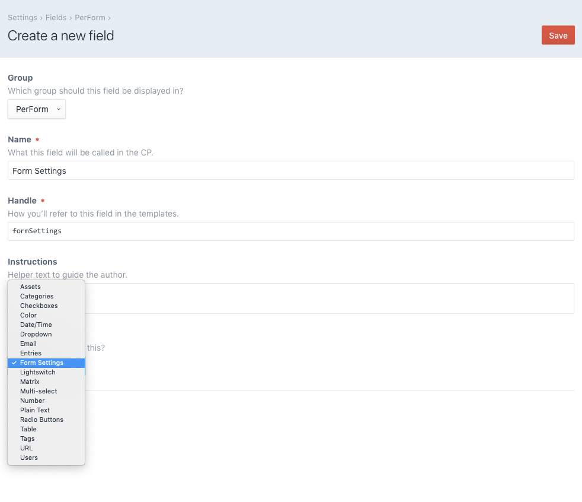
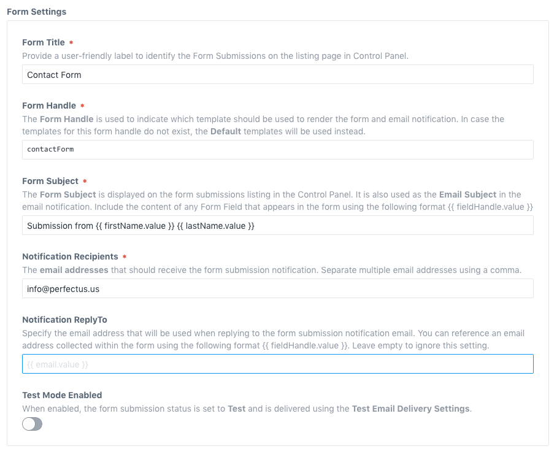
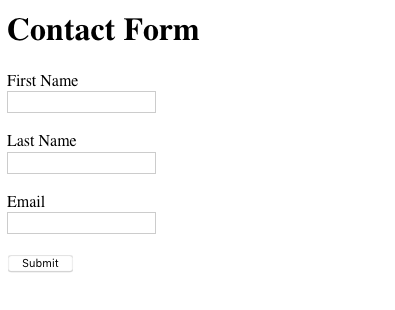

# PerForm plugin for Craft CMS 3.x

PerForm facilitates form handling for Craft developers. Process, test, store, send email notifications, configure client side validation, include powerful spam protection, and more.


## Requirements

This plugin requires Craft CMS 3.0.18 or later.

## Installation

To install the PerForm plugin, follow these instructions:

1. Open your terminal and go to your Craft project:

        cd /path/to/project

2. Then tell Composer to load the plugin:

        composer require perfectus/perform

3. In the Control Panel, go to *Settings → Plugins* and click the “Install” button for PerForm.

PerForm works on Craft 3.x.

## PerForm Usage Notes

### Issues

Please report any issues you find to the [PerForm Issues](https://github.com/ohlincik/craft-perform/issues) page.

## PerForm Overview

PerForm is built for **Craft CMS web developers** with ultimate flexibility in mind. The goal is to let you build the web form front-end anyway you'd like while following a handful of simple conventions. After you include the web form in your Twig template, the plugin will assist you with the following:

* Client-side form validation using [Parsley](http://parsleyjs.org/)
* Spam protection using the [Google Invisible ReCaptcha](https://developers.google.com/recaptcha/docs/invisible)
* Saving the form submissions in the Control Panel for future reference
* Delivering the form submission content via email (built-in testing using [Mailtrap](https://mailtrap.io/))


## Using PerForm

Using PerForm is quite simple. The following needs to be in place to get PerForm working properly.

1. PerForm **formTag** — to make sure that the form will be submitted to and processed by PerForm
2. Form built according to PerForm **form fields conventions** — to make sure that PerForm knows which fields need to be processed
3. PerForm **form settings** — to let PerForm know how to process the form submission
4. PerForm **plugin settings** — to configure additional options and connect PerForm with external services

Continue reading below to learn more about each concept. We're going to put together a simple form that collects *First Name*, *Last Name* and *Email* to illustrate how to build, setup and configure a form that will be processed by PerForm.

### PerForm `formTag`

The `formTag` variable generates the opening `<form>` tag. The form will not be processed without it.

```twig
{{ craft.perForm.formTag({
  'entryId': entry.id
}) }}
```

The `formTag` has one required configuration option **entryId** that specifies which entry contains the *Form Settings* for the form that will be included below. This will generate html code that looks something like this.

```html
<noscript>
    <style type="text/css">
        #perform-submission {
            display: none;
        }
    </style>
    <p class="perform--warning-panel">
        <strong>You don't have JavaScript enabled.</strong><br>
        To continue, please <a href="http://enable-javascript.com/" target="_blank">
        enable JavaScript in your browser</a>.
    </p>
</noscript>

<form role="form" id="perform-submission" method="post" action="" accept-charset="UTF-8">
    <input type="hidden" name="action" value="perform/public/submit-form">
    <input type="hidden" name="entry_id" value="2">
    <input type="hidden" name="CRAFT_CSRF_TOKEN" value="yWz6...">

```

Note, that if you provide an incorrect **entryId** or have not setup the *Form Settings* associated with the provided **entryId** properly, you will see a message on the screen that looks like this.


### PerForm form fields conventions

PerForm is not concerned with how you decide to build your form, that's totally up to you. While you're building your form, you need to keep one important convention in mind. You need to let PerForm know what are the field lables and values that whould be processed and stored.

```html
<label for="fields_firstName">First Name</label>
<input type="hidden" name="fields[firstName][label]" value="First Name">
<input type="text" id="fields_firstName" name="fields[firstName][value]">
```

In the example above, PerForm will process and store the field for **First Name** textbox. You need to let PerForm know what is the field label and what is the field value:

- *Label:* use a hidden field `<input type="hidden" name="fields[firstName][label]" value="First Name">`
- *Value:* configure the input **name** to correspond with the hidden field for label `name="fields[firstName][value]"`

Note that in the example above, you can replace `firstName` with anything you'd like. In fact, you will need to provide a unique 'handle' for each field you want PerForm to process. Of course, you don't need to build the fields by hand (and you shouldn't). There are many ways to go about this, for example, you can use *Twig Macros*, *Twig Includes* or a combination of both.

### PerForm form settings

PerForm comes with a *Form Settings* field type that allows you to add a field to an entry that will include your form. You will need to create a field and add it to the layout of your entry (actually, this can be any entry, not specifically the entry that will include the template to generate your form). You will specify which entry includes the form settings through the [formTag variable](#perform-formtag).



Once you create the field and associate it with an entry layout, you can provide the appropriate settings for the particular form.



- **Form Title** — a user-friendly label to identify the form submissions that come from this form in the listing page in Control Panel.
- **Form Handle** — this setting is useful if you decide to provide different templates for different form and if you want to setup your own *email content templates*.
- **Form Subject** — what will be displayed on the form submissions listing in the Control Panel and used for the *Email Subject* of the email notification. The subject is processed by Twig so you can include the content of any field that appears in the form using the following format `{{ fieldHandle.value }}`.
- **Notification Recipients** — one or more email addresses that should receive the form submission notification after the form is submitted and processed.
- **Notification ReplyTo** — the form submission notification email is sent using the **System Email Address** configured in the *Control Panel → Settings → Email* so whenever the recipient clicks the 'Reply' button in their email client, the email reply would not go to whomever actually submitted the form. You can provide the email address of the actual person that submitted the form if you are collecting it through the form, in which case you just need to reference the value of the form field. For example, `{{ email.value }}` if the form input handle happens to be 'email'.
- **Test Mode Enabled** — when this setting is ON, the form submissions will be automatically set to **Test** status and delivered according to the *Test Email Delivery Settings* instead of the email addresses specified in the 'Notification Recipients'.

### PerForm plugin settings


- **Test Email Delivery Settings** — use the [Mailtrap](https://mailtrap.io) email testing service to test out the PerForm email notifications. Sign up for an account at Mailtrap and input the Inbox *Username* and *Password* in the provided fields.
- **Client Side Validation** — PerForm currently does not offer *Server-side form validation* but you can easily validate your form fields **before** the form is submitted. When you check this setting, PerForm will automatically include 'parsley.js' in each form. You will need to [configure your form inputs](http://parsleyjs.org/doc/index.html#validators) to work with Parsley.
- **Google Invisible reCAPTCHA Configuration** — when you turn on this setting, the Google Invisible reCAPTCHA will be automatically enabled for all PerForm driven forms within your site. You can [learn more](https://developers.google.com/recaptcha/docs/invisible) about how it works, but all you need to do is [create reCAPTCHA API keys](https://www.google.com/recaptcha/admin#list) for your site and PerForm will take care of everything else.
- **Custom Email Templates** — provide your own templates to generate the *email notifications*

## Example: Simple Contact Form

This example will introduce you to how the [various concepts](#using-perform) fit together and will ultimately allow you to build much larger and more complex forms.

The following template code:

```twig


  <h1>Contact Form</h1>

  
    <p>Thank you for submitting your information</p>
  
    {# Generate the PerForm form tag #}
    {{ craft.perForm.formTag({
      'entryId': entry.id
    }) }}

      {# First Name field #}
      <label for="fields_firstName">First Name</label><br>
      <input type="hidden" name="fields[firstName][label]" value="First Name">
      <input type="text" id="fields_firstName" name="fields[firstName][value]">

      <br><br>

      {# Last Name field #}
      <label for="fields_lastName">Last Name</label><br>
      <input type="hidden" name="fields[lastName][label]" value="Last Name">
      <input type="text" id="fields_lastName" name="fields[lastName][value]">

      <br><br>

      {# Email field #}
      <label for="fields_email">Email</label><br>
      <input type="hidden" name="fields[email][label]" value="Email">
      <input type="email" id="fields_email" name="fields[email][value]">

      <br><br>

      <button type="submit">Submit</button>
    </form>
  

```

With the following Form Settings:


And, without any styling, will generate a very simple form.



By default, PerForm will redirect the browser to the **original url** and set a flash message with the **submissionId** key ([more details](#redirecting-after-submit) about redirecting and flash messages) which you can test for and display a "Thank You" message for the visitor. So, after filling out and submitting the form, the visitor will see this content in the browser:


The form submission will be processed by PerForm, saved in the Control Panel:


Where a user with the appropriate permissions can see the form submission detail:


And, the **notification recipient** receives the following email notification:


### Redirecting after submit

By default, PerForm will automatically reload the current page. 

To override this default behavior, include `redirectInput` function after the PerForm `formTag` and specify your redirect destination.

```twig
{# Generate the PerForm form tag #}
{{ craft.perForm.formTag({
'entryId': entry.id
}) }}

{{ redirectInput('contact-form/thank-you') }}
```

Sometimes it's convenient to retrieve and display the information included in the form submission on the 'thank you' page. You can achieve this by setting query string parameters (although, there is a [much better way](#using-flash-messages)). The following variables can be used within the URL/path you set:

- `submissionId` — the ID of the Form Submission. You can use it to retrieve the entire submission content using the `getSubmissionById` plugin variable, however, for security reasons it is not advisable to expose the ID as a query string parameter. There is a [much better way](#using-flash-messages) to do this built into PerForm.
- `dateCreated` — the date/time when submission was created
- `dateUpdated` — the date/time when submission was last updated (same as `dateCreated` in this case)
- `statusType` — new, read, test *(note that since the submission was just submitted, it will be set to either 'new' or 'test' status)*
- `formHandle` — specified in the *Form Settings*
- `formTitle` — specified in the *Form Settings*
- `subject` — the subject generated using the **Form Subject** template specified in the *Form Settings*
- `replyTo` — the email address extracted based on the **Notification ReplyTo** template specified in the *Form Settings*
- `recipients` — one or more email addresses as specified in the **Notification Recipients** setting in the *Form Settings*. The values are returned as an *array*.
- `fields` — the fields included in the form and submitted to PerForm. The values are returned as an *array* and you can use the field handles to retrieve the submitted values and labels.

For example, if your form looks like this:

```twig
{{ redirectInput('contact-form/thank-you?replyTo={replyTo}&firstName={fields.firstName.value}') }}

{# First Name field #}
<input type="text" id="fields_firstName" name="fields[firstName][value]">

{# Last Name field #}
<input type="text" id="fields_lastName" name="fields[lastName][value]">

{# Email field #}
<input type="text" id="fields_email" name="fields[email][value]">
```

On your `contact-form/thank-you.html` template, you can access the parameters using the `craft.app.request.getQueryParam()`:

```twig
<p>
	{{ craft.app.request.getParam('firstName') }}, thank you for submitting your information.
	
		<br>
		We will use the {{ craft.app.request.getParam('replyTo') }} email address to send you a reply.
	
</p>
```

### Using flash messages

When a form submission is successfully processed, PerForm will set a flash message with the **submissionId** key and submission ID as value to indicate that the form submission was successful. In addition to checking whether the form was successfully processed, this also gives you the ability to retrieve the entire submission content using the  `getSubmissionById` plugin variable. The advantage of using this method as opposed to [sending the submissionId as a query parameter](#redirecting-after-submit) is two-fold. First, the actual submission ID cannot be easily extracted from the response, and second, it is no longer available when the page is refreshed (making this approach work very well when redirecting to the same template that includes the form itself).

Using the example from above:

```twig
{{ redirectInput('contact-form/thank-you') }}

{# First Name field #}
<input type="text" id="fields_firstName" name="fields[firstName][value]">

{# Last Name field #}
<input type="text" id="fields_lastName" name="fields[lastName][value]">

{# Email field #}
<input type="text" id="fields_email" name="fields[email][value]">
```

On your `contact-form/thank-you.html` template, you can retrieve the **submissionId** from the session flash and use it to fetch the entire submission content using the `getSubmissionById` plugin variable (here is the [list of all submission variables](#redirecting-after-submit)):

```twig

	
	
    <p>
		{{ submission.fields.firstName.value }}, thank you for submitting your information.
        
            <br>
            We will use the {{ submission.replyTo }} email address to send you a reply.
        
	</p>

    <p class="message error">{{ craft.app.session.getFlash('error') }}</p>

```

As you can see in the example above, if a flash with the **submissionId** key has not been set, PerForm could not process the form submission and it is likely that an `error` flash message was set instead.

## Example: Full-featured Complex Form

Content is coming soon...

## PerForm Widget

You can enable the PerForm **dashboard widget** to keep track of the various form submissions.


## PerForm Utility

The handy PerForm **utility** allows you to easily delete all the *Test Submissions* from the Control Panel.


## Control Panel Permissions

If you are using Craft CMS "Pro" edition, PerForm provides permissions that can be used to grant access to users based on their User Group. These are set in *Settings → Users → User Groups*.

#### Grant General Access to PerForm


With **General Access** to PerForm the users are able to:

- List, view, delete and change the status of all form submissions
- Add and utilize the _PerForm Dashboard Widget_

#### Grant Utilities Access to PerForm


With **Utilities Access** to PerForm the users are able to:

- Access the PerForm page under Craft CMS Utilities section and easily delete all test form submissions

## PerForm Roadmap

Some things to do, and ideas for potential features:

* Process forms submitted through AJAX
* Add preview of form submission fields in **Test Mode**
* Add the option to send a *receipt* or *confirmation* after a form is submitted
* [Submit your new feature request](https://github.com/ohlincik/craft-perform/issues) if you need PerForm to do something specific that would be useful for other Craft developers...

Brought to you by [Perfectus Digital Solutions](https://perfectus.us)
